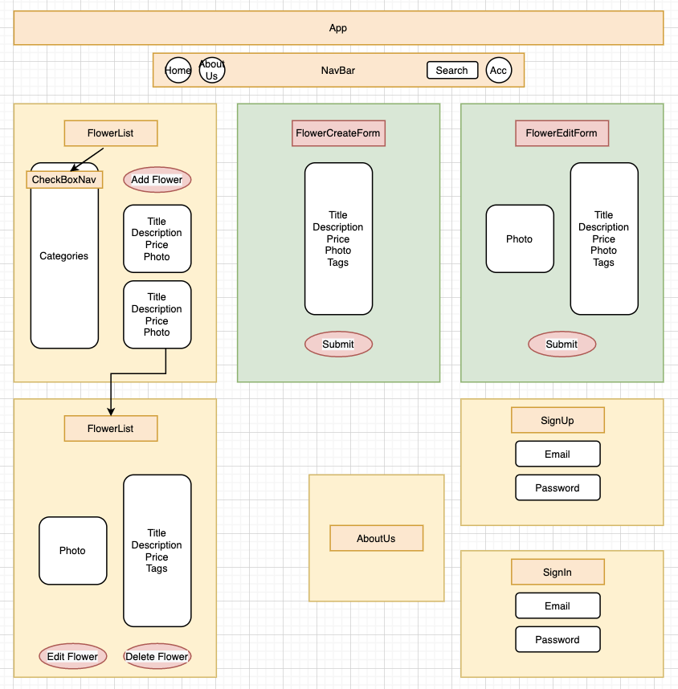

# **Gurumi the Florist**

#### _A capstone application using Ruby and React. DATE 7/17/20_

#### By _**Chisato Murakami**_

## Description

_This is a flower shop website, that will allow the user to see the pictures of the flower bouquets and search by tags of kinds, occasions, seasons, and so on. The admin user is able to use full CRUD functionality to manage the website._ 

## Setup/Installation Requirements

* _Clone Repository from GitHub : https://github.com/cheemurakami/gurumi_the_florist
* _Run `rails s`
* _Run `bin/webpack-dev-server` in the other terminal
* _Open folder in Virtual Studio Code (or your text editor of choice)_
* _Open your terminal in Virtual Studio Code & type code . this will open all files associated with this app. 
* _Before you initialize GIT, be sure to delete the already exisiting .git file by running this command in your terminal $rm -rf .git_
* _Create your own repository and push new changes to GitHub_

**

## Behavior Driven Development 

|   **Behavior Description**        |
|-------------------------------|
| 1. All users see the lists of flowers at home page. [√]|
| 2. All users can click one of the lists and that navigates to FlowerDetail page. [√]|
| 3. Admin users can create a flower with title, description, price, images, and tags. [√]|
| 4. Admin users can update a flower with title, description, price, images, and tags. [√]|
| 5. Admin users can delete a flower. [√]|
| 6. Admin users can delete a image. [√]|
| 7. All users can search a flower by typing a category or a tag in nav bar. [√]|
| 8. All users can search a flower by selecting categories and tags in sub nav bar. [√]|

|   **Stretch Goals for e-commerce functionality**        |
|-------------------------------|
| 1. Logged-in users can select flowers and add these in favorite/cart. [√]|
| 2. Logged-in users can see flowers and save these in favorite/cart. [√]|
| 3. Logged-in users can unfavorite flowers. [√]|
| 4. Logged-in users can remove flowers in cart. [√]|
| 5. Logged-in users can select payment options. []|
| 6. Logged-in users can process payment. []|
| 7. Show recommended flowers based on users selections. []|

## Known Bugs

_No known bugs at this time_

## Support and contact details

_If you have any questions or any issues please feel free to submit an issue here: kiwipom1031@gmail.com_

## Technologies Used

_JavaScript, React, Redux, Ruby on Rails, React Bootstrap_ 

### Licenses
*MIT LICENSE*

Copyright (c) 2020 **Chisato Murakami**

